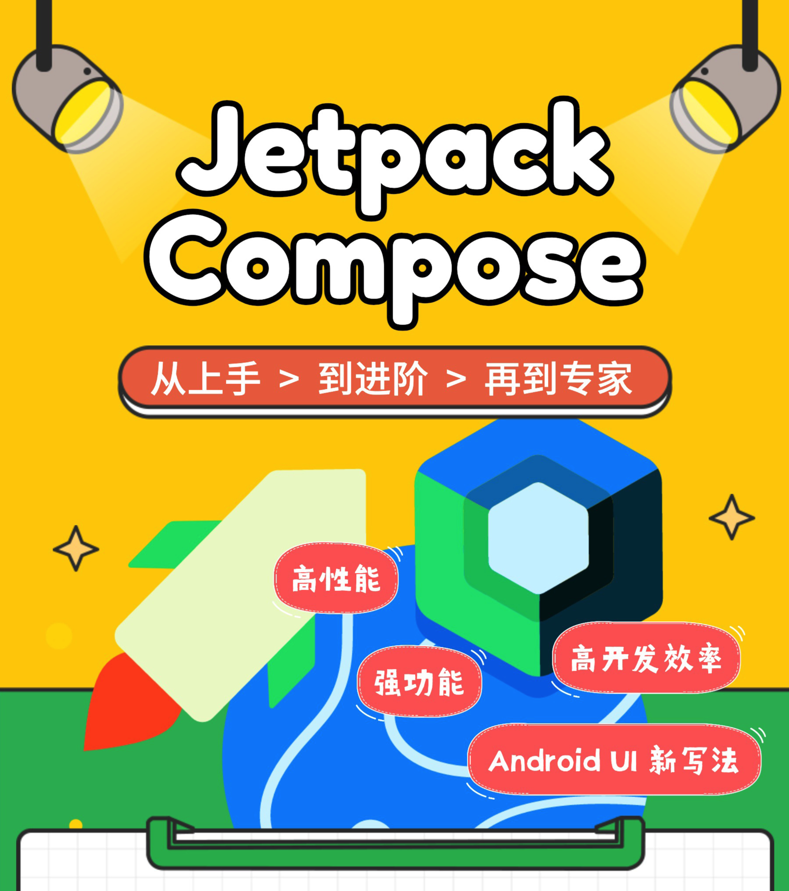
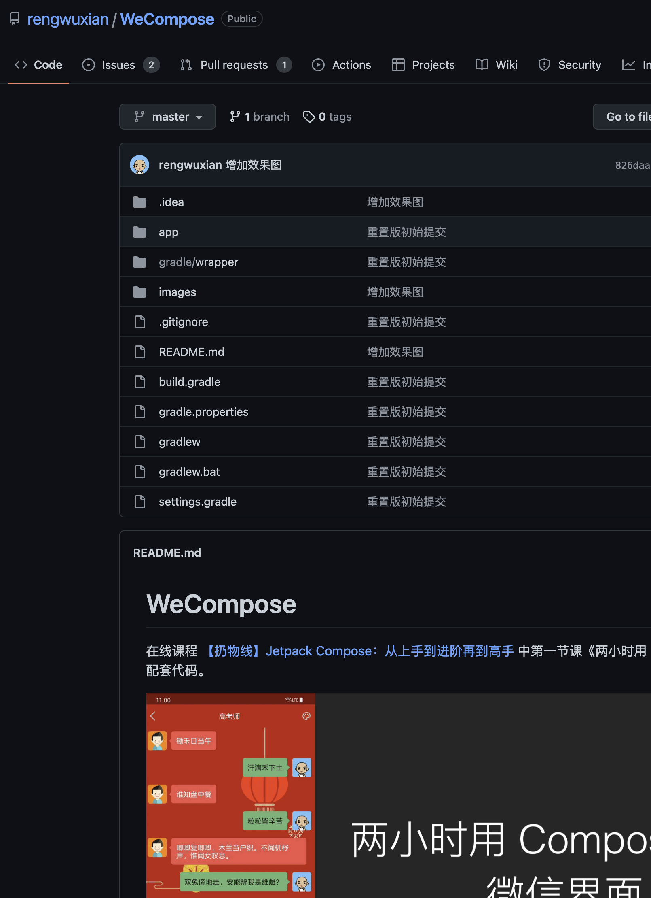
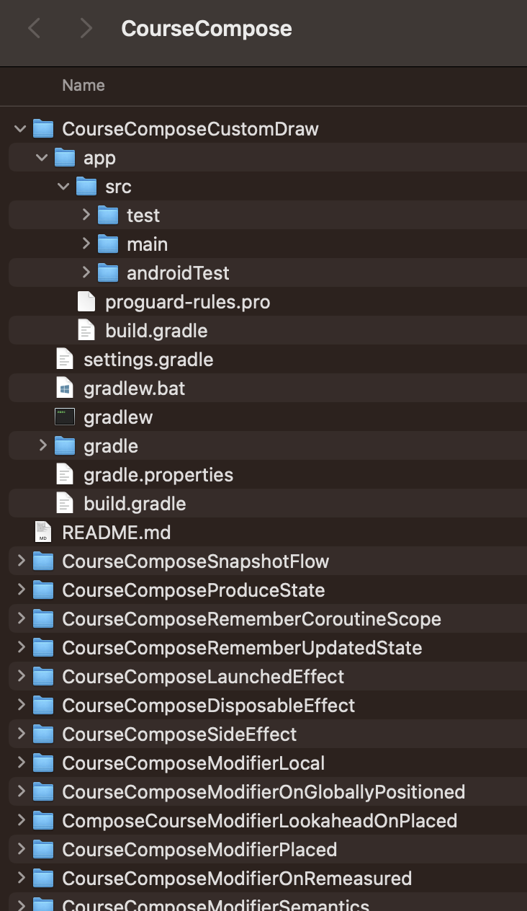

# 【不是开源项目】扔物线 Compose 课程源码

课程地址：[Jetpack Compose：从上手到进阶再到高手](http://url.rengwuxian.com/02)

# 源码导航

* 1-两小时用 Compose 写个聊天界面：[https://github.com/rengwuxian/WeCompose](https://github.com/rengwuxian/WeCompose) ——这是唯一有独立仓库的代码，因为它可以作为开源项目存在。后面每个课节的代码都在本仓库中的不同目录下，而不再为它们各自单独建立代码仓库。
* 4.1-状态转移型动画 animateXxxAsState()：[./CourseComposeAnimateAsState](./CourseComposeAnimateAsState)
* 4.2-流程定制型动画 Animatable 和 LaunchedEffect()：[./CourseComposeAnimatable](./CourseComposeAnimatable)
* 4.3-动画的详细配置 AnimationSpec：[./CourseComposeAnimationSpec](./CourseComposeAnimationSpec)
* 4.4-消散型动画 animateDecay()：[./CourseComposeAnimateDecay](./CourseComposeAnimateDecay)
* 4.5-block 参数：监听每一帧：[./CourseComposeAnimatableBlock](./CourseComposeAnimatableBlock)
* 4.6-打断施法：动画的边界限制、结束和取消：[./CourseComposeAnimatableEnding](./CourseComposeAnimatableEnding)
* 4.7-Transition：多属性的状态切换：[./CourseComposeTransition](./CourseComposeTransition)
* 4.8-Transition 延伸：AnimatedVisibility()：[./CourseComposeTransitionComposable](./CourseComposeTransitionComposable)
* 4.9-Transition 延伸：Crossfade()：[./CourseComposeTransitionComposable](./CourseComposeTransitionComposable)
* 4.10-Transition 延伸：AnimatedContent()：[./CourseComposeTransitionComposable](./CourseComposeTransitionComposable)
* 5.1-modifier_ Modifier = Modifier 的含义：[./CourseComposeModifier](./CourseComposeModifier)
* 5.2-Modifier.then()、CombinedModifier 和 Modifier.Element：[./CourseComposeModifierThen](./CourseComposeModifierThen)
* 5.3-Modifier.composed() 和 ComposedModifier：[./CourseComposeModifierComposed](./CourseComposeModifierComposed)
* 5.4-LayoutModifier 和 Modifier.layout()：[./CourseComposeModifierLayout](./CourseComposeModifierLayout)
* 5.5-DrawModifier 的工作原理和对绘制的精细影响：[./CourseComposeModifierDraw](./CourseComposeModifierDraw)
* 5.6-PointerInputModifier 的功能介绍和原理简析：[./CourseComposeModifierPointerInput](./CourseComposeModifierPointerInput)
* 5.7-ParentDataModifier 的作用、写法和原理：[./CourseComposeModifierParentData](./CourseComposeModifierParentData)
* 5.8-SemanticsModifier 的作用、写法和原理：[./CourseComposeModifierSemantics](./CourseComposeModifierSemantics)
* 5.10-OnRemeasuredModifier 的作用、写法和原理：[./CourseComposeModifierOnRemeasured](./CourseComposeModifierOnRemeasured)
* 5.11-OnPlacedModifier 的作用、写法和原理：[./CourseComposeModifierPlaced](./CourseComposeModifierPlaced)
* 5.12-LookaheadOnPlacedModifier 的作用、写法和原理：[./CourseComposeModifierLookaheadOnPlaced](./CourseComposeModifierLookaheadOnPlaced)
* 5.13-OnGloballyPositionedModifier 的作用、写法和原理：[./CourseComposeModifierOnGloballyPositioned](./CourseComposeModifierOnGloballyPositioned)
* 5.14-ModifierLocal 和 ModifierLocalProvider、ModifierLocalConsumer：[./CourseComposeModifierLocal](./CourseComposeModifierLocal)
* 6.1-「副作用（附带效应）」和 SideEffect()：[./CourseComposeSideEffect](./CourseComposeSideEffect)
* 6.2-DisposableEffect()：[./CourseComposeDisposableEffect](./CourseComposeDisposableEffect)
* 6.3-协程：LaunchedEffect()：[./CourseComposeLaunchedEffect](./CourseComposeLaunchedEffect)
* 6.4-rememberUpdatedState()：[./CourseComposeRememberUpdatedState](./CourseComposeRememberUpdatedState)
* 6.5-协程：rememberCoroutineScope()：[./CourseComposeRememberCoroutineScope](./CourseComposeRememberCoroutineScope)
* 6.6-从 produceState() 说起：协程（和其他）状态向 Compose 状态的转换：[./CourseComposeProduceState](./CourseComposeProduceState)
* 6.7-snapshotFlow()：把 Compose 的 State 转换成协程 Flow：[./CourseComposeSnapshotFlow](./CourseComposeSnapshotFlow)
* 7.1-自定义绘制：[./CourseComposeCustomDraw](./CourseComposeCustomDraw)
* 7.2.1-自定义布局和 Layout()：[./CourseComposeCustomLayout](./CourseComposeCustomLayout)
* 7.2.2-自定义布局：SubcomposeLayout()：[./CourseComposeSubcomposeLayout](./CourseComposeSubcomposeLayout)
* 7.2.3-自定义布局：LookaheadLayout()：[./CourseComposeLookaheadLayout](./CourseComposeLookaheadLayout)
* 7.3.1-自定义触摸和一维滑动监测：[./ComposeCourceDrag1D](./ComposeCourceDrag1D)
* 7.3.2-嵌套滑动和 nestedScroll()：[./ComposeCourceNestedScroll](./ComposeCourceNestedScroll)
* 7.3.3-自定义触摸：二维滑动监测：[./ComposeCourceDetectDragGestures](./ComposeCourceDetectDragGestures)
* 7.3.4-自定义触摸：多指手势：[./CourseComposeDetectTransformGestures](./CourseComposeDetectTransformGestures)

# 使用方式
- 第一节【1-两小时用 Compose 写个聊天界面】：点开上面第一节的链接，把 WeCompose 仓库 clone 到本地就行了。
  
  
- 其他节：
  1. 把本仓库（对，就是这个仓库）clone 到本地。这个仓库里包含了除第一节以外所有节的教案。
  2. 用 Android Studio 打开对应课节的目录。
    
